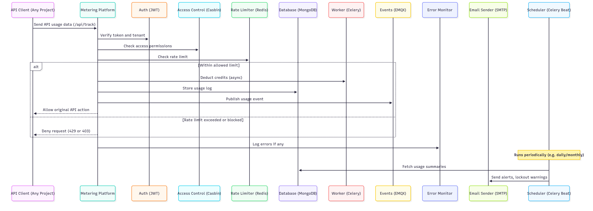

# API Management & Usage Control Platform

## Problem Statement:

As businesses increasingly rely on APIs to deliver services, manage integrations, and expose features to external developers or partners, it becomes essential to monitor and control how these APIs are being used. Without proper tracking, rate-limiting, and billing mechanisms, platforms risk system overload, unfair access to premium features, and significant revenue loss.

### Real-World Examples:

- **GitHub** had to introduce stricter rate limits and personal access tokens after scraping bots started aggressively consuming API bandwidth from free-tier users.
- **OpenAI** experienced performance degradation due to traffic surges from trial users, leading to stricter per-user and credit-based usage controls.
- **Twitter/X** imposed aggressive rate limits to combat abuse by third-party scrapers and spam bots, unintentionally impacting genuine users and developers.

These incidents show that lacking a structured usage control system leads to:
- Infrastructure overload from unmonitored traffic  
- Abuse of free or public APIs  
- Poor visibility into usage patterns  
- Billing inaccuracies or revenue leakage  
- Frustration for legitimate users due to blanket restrictions

---

## Our Solution

We are building a reusable, multi-tenant **API Usage Metering & Billing Platform** that:

- Tracks every API call by `tenant_id`, `service_name`, `endpoint`, and `method`
- Deducts credits based on plan, region, or feature type
- Enforces rate limits and plan-specific access
- Blocks or restricts access to premium endpoints for lower-tier plans
- Sends alerts and invoices automatically via email
- Implements admin and user roles via secure access control
- Can integrate with **any future API project** using a simple `/api/track` endpoint

> This platform will act as the **central controller** for usage and billing across multiple APIs and tenants.

---

## Tech Stack & Purpose:

| Tool             | Purpose                                       |
|------------------|-----------------------------------------------|
| **FastAPI**       | For building the main API service             |
| **MongoDB**       | To store tenants, users, plans, and usage logs |
| **Redis**         | To handle rate limiting and login lockouts    |
| **Celery**        | For background tasks like credit deduction    |
| **Celery Beat**   | For scheduled jobs like monthly invoicing     |
| **EMQX (MQTT)**   | To stream API usage events in real time       |
| **JWT**           | For secure authentication and token management |
| **Casbin**        | For admin vs user access control              |
| **Sentry**        | For error monitoring and alerting             |
| **Infisical**     | For managing environment secrets securely     |
| **SMTP**          | To send email alerts and warnings             |


---

## Architecture Diagram

> _Architecture showing API client → Metering Platform → services (MongoDB, Redis, Celery, EMQX, SMTP, etc.)_


---

## End-to-End Workflow with Any API Project

### Step 1: User Signs Up (Tenant Onboarding)
- A user (tenant) signs up through a public /auth/signup endpoint.
- During sign-up:
  - The user provides email, password, and basic details.
  - By default, it is free plan but User can choose plan (Basic, Pro, etc.).

Each plan defines:
- Rate limits (e.g., 10 requests/day)
- Credits per call
- Access to premium features or endpoints

### Step 2: API Project Sends Usage Metadata to Metering Platform
```json
{
  "tenant_id": "abc123",
  "service_name": "notes-api",
  "endpoint": "/notes",
  "method": "POST",
  "credits_used": 2,
  "premium": true
}
```

### Step 3: Metering Platform Processes the Request
- Validates the JWT token (authenticates tenant)
- Checks access permissions using Casbin
- Verifies:
  - If enough credits are available
  - If the endpoint is allowed under the plan
  - If within rate limits (via Redis)

### Step 4: Deduct Credits & Store Usage Log
- Deducts credits (via Celery)
- Logs usage to MongoDB
- Publishes real-time event to EMQX
- Logs errors (if any) to Sentry

### Step 5: Monthly Aggregation & Alerts
- Celery Beat resets credits and aggregates usage
- SMTP sends invoices and low-credit alerts

### Step 6: Admin Panel Usage
- View usage logs and credit stats
- Update plans, credits, or unlock tenants


---

## 4-Day Sprint Plan:

| Day        | Tasks |
|------------|-------|
| **Day 1**  | Set up FastAPI backend, MongoDB schemas, JWT auth, RBAC, Redis |
| **Day 2**  | Add Celery, credit deduction, SMTP alerts, login lockouts      |
| **Day 3**  | Integrate EMQX, premium endpoint logic, usage endpoints, Sentry |
| **Day 4**  | Full testing, finalize Casbin rules, write docs, add extras    |

---

> This platform is built to be **generic and reusable**, so it can support any future APIs (e.g., chat, upload, report APIs) by simply sending usage events to the central metering engine.
